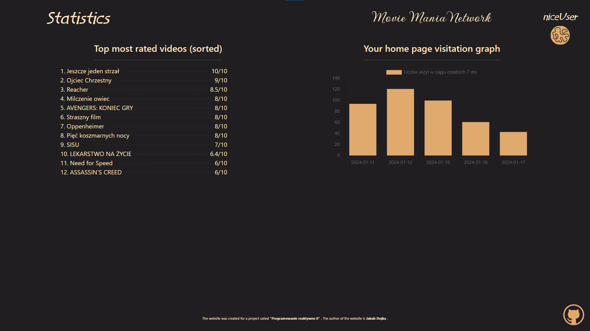
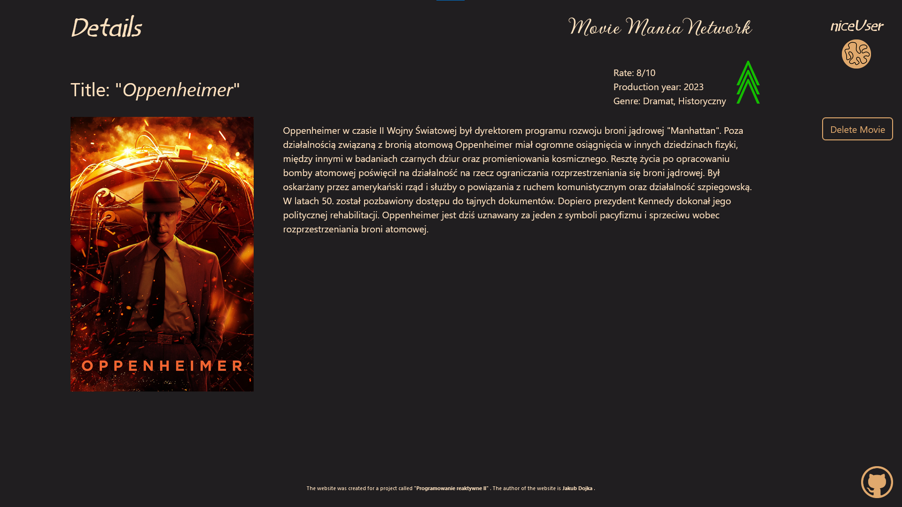
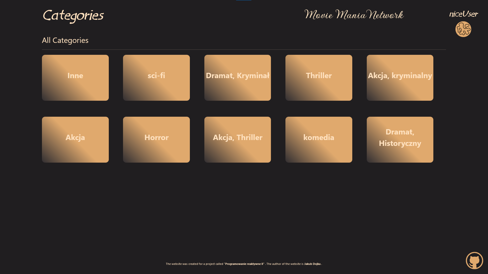
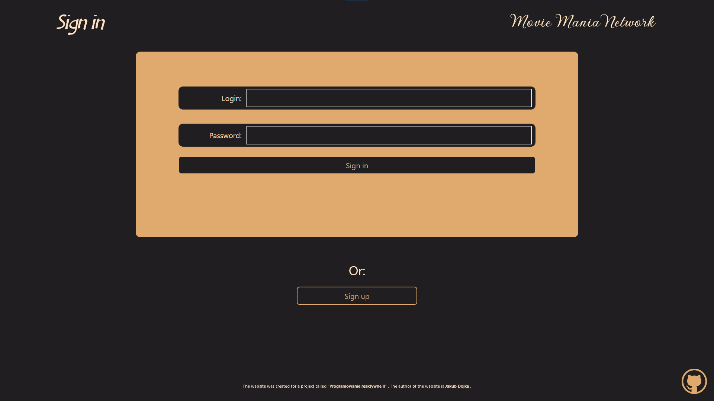
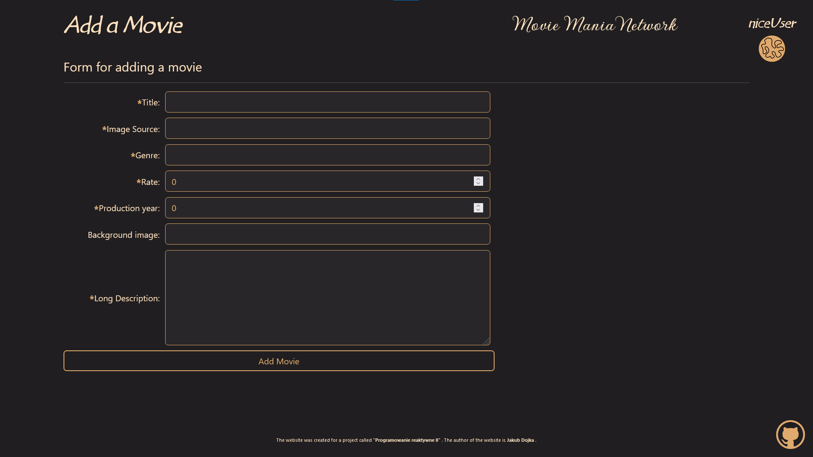

### Website written in ReactJS for browsing, adding video reviews.

## Author

- [@Narothe](https://github.com/Narothe)

## Main branch updates

- phase_3: 21.11.2023r. - Create project, main idea of the view.
- phase_4: 18.12.2023r. - Developing phase_3. Completing the page with the other subpages and how they work.
- phase_5: 12.01.2024r. - Plugging the entire site under the API. Major changes in the appearance of the website.


## How to install

You need to have "Node.js" (LTS version is the best) downloaded to run the project.
 - [Node.js](https://nodejs.org/en)


Throughout the project, I used the "yarn" command to install/add dependencies/run the project.

- [yarn](https://classic.yarnpkg.com/lang/en/docs/install/#windows-stable)

```
yarn install
```

## How to start

```
yarn start
```

## Other way to install and start

- Inside of files you should find files "project_yarn_install.bat" and "project_yarn_start.bat". If you are using Windows OS you can use them as well to install and start the project (you still need Node.js and yarn installed).

- If for some reason you want to use npm:

```
npm install
```

```
npm start
```

## Project started. What now?

Open [http://localhost:3000]( http://localhost:3000) in your browser to view the website.

Note: Open project at port `3000`, not `3001` or another. Reason: Other port may cause problems with css styles and display of elements in site.

### The Browsers used while creating project: 
- Google Chrome version: 120.0.6099.217 (64-bit)
- Firefox 121.0 (64-bit)

## Project Structure

The components are divided into catalogs that correspond to applications. If a component (element) is used only in one place in the project, it is located in the parent folder.


## Preview images of the application

### Conceptual design (phase_3)

Screenshot_1:


Screenshot_2:


### Current design (phase_6)

Screenshot_1:


Screenshot_2:


Screenshot_3:


Screenshot_4:


Screenshot_5:


Screenshot_6:


Screenshot_7:


Screenshot_8:


Screenshot_9:

